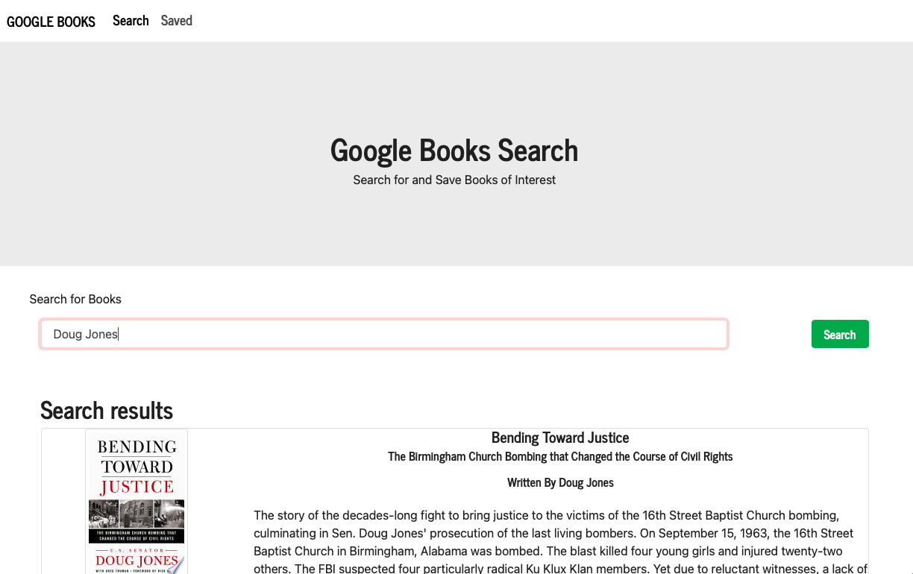
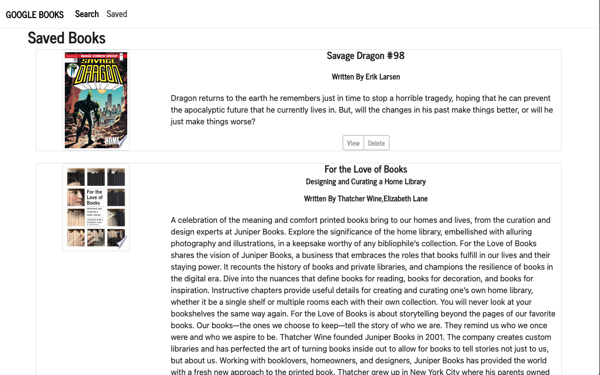

# React Google Books Search
## Description
 An application created using the MERN stack and allows users to search for books via the Google Books API. Search results are dynamically rendered and users have the option to save books or view them in GoogleBooks directly for purchase.  From the saved books page, the user can delete books that they no longer want to save.
 
  [Link to Deployed Application](https://obscure-thicket-71469.herokuapp.com)
  
  
  
  ## Table of Contents
  * [Installation](#installation)
  * [Languages and Technologies Used](#languages)
  * [Questions](#questions)
  
  ## Installation
 - assuming node and npm are installed. 

```shell
$ git clone git@github.com:sfunk11/google-books-search
$ cd google-books-search/
$ npm i
```
  ### Screenshots
  
   
  


  ## Languages and Technologies Used
  * React
  * HMTL / CSS
  * Javascript
  * MongoDB / Atlas
  * Deployed to Heroku web hosting
  * Google Books API
  * Node.js and packages:
    * create-react-app
    * axios
    * mongoose
    * react-bootstrap
    * react-router-dom
    * axios
    * express

   
    

  
  ## Questions
  If you have any questions, please send them to me through GitHub or email.

  Github Username: sfunk11

  [borley1@gmail.com](mailto:borley1@gmail.com)